# 在 8 GB 显存笔记本上跑 VGGT 和 Depth Anything 3

一篇实测笔记。不抄论文数字，全部是我在自己这台 **RTX 5060 Laptop (8 GB)** 上跑出来的。

跑的东西：**VGGT**（CVPR 2025 最佳论文）和 **DA3 / Depth Anything 3**（字节跳动），
顺带把周边一圈模型（VGGT-Ω、D4RT、VGG-T³、π³ 等）的现状和许可证查了一遍。

---

## 目录

- [一、VGGT](#一vggt)
  - [1.1 输入](#11-输入)
  - [1.2 输出：模型到底吐了什么](#12-输出模型到底吐了什么)
  - [1.3 输出字段逐个读](#13-输出字段逐个读)
  - [1.4 转成 GLB，在 Blender 里看](#14-转成-glb在-blender-里看)
  - [1.5 一个我绕进去的坑：为什么不去重](#15-一个我绕进去的坑为什么不去重)
  - [1.6 不去重的后果](#16-不去重的后果)
  - [1.7 回头看模型结构](#17-回头看模型结构)
- [二、Depth Anything 3](#二depth-anything-3)
- [三、把两个模型放在一起比](#三把两个模型放在一起比)
  - [发现 1：深度图几乎一模一样](#发现-1深度图几乎一模一样)
  - [发现 2：但数值整整差了 1.9 倍](#发现-2但数值整整差了-19-倍)
  - [发现 3（顺手跑的）：小模型快得离谱](#发现-3顺手跑的小模型快得离谱)
- [四、我踩到的坑](#四我踩到的坑)
- [五、许可证：这个最坑，必须单独说](#五许可证这个最坑必须单独说)
- [六、现在最火 / 最强的是啥](#六现在最火--最强的是啥)
- [七、我的结论](#七我的结论)
- [附：复现脚本](#附复现脚本)

---

## 一、VGGT

全名 **Visual Geometry Grounded Transformer**，CVPR 2025 最佳论文。

### 1.1 输入

随意几张同一场景、不同角度的照片。我这里用三个视角拍了我的水杯。

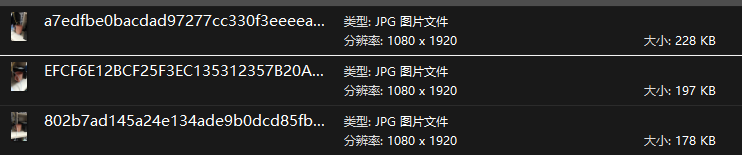

*输入：三张水杯照片（1080×1920），三个视角。*

### 1.2 输出：模型到底吐了什么

刚开始直接抄官网给的实践代码。

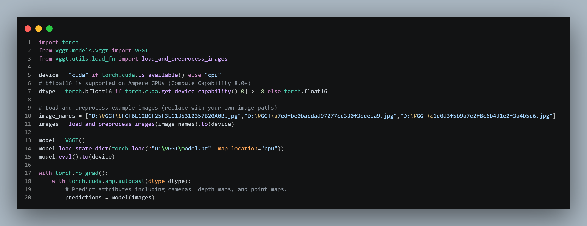

*官网 `run_vggt.py` 的实践代码。*

这个是没有输出的，只是把值存在 `predictions` 里了。

查了一下 clone 下来的仓库，`vggt.py` 里的 docstring 写了有这些输出：

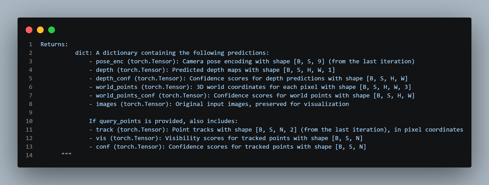

*`vggt.py` 里 `Returns:` 那段 docstring —— 这就是模型输出的"菜单"。*

所以我写了一个 `print` 看输出：

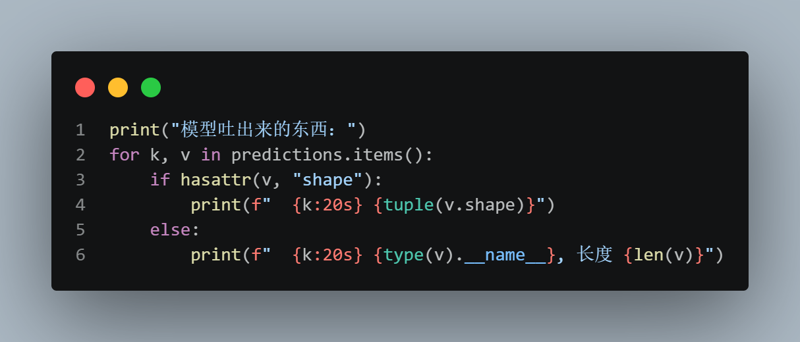

结果如图：

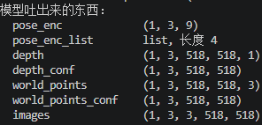

依次是：

| 键 | 形状 | 是什么 |
|---|---|---|
| `pose_enc` | `(1, 3, 9)` | 相机位姿编码，每张图 9 个数 |
| `pose_enc_list` | list，长度 4 | 4 次迭代的中间结果 |
| `depth` | `(1, 3, 518, 518, 1)` | 深度图 |
| `depth_conf` | `(1, 3, 518, 518)` | 深度的置信度 |
| `world_points` | `(1, 3, 518, 518, 3)` | 3D 世界坐标点 |
| `world_points_conf` | `(1, 3, 518, 518)` | 3D 点的置信度 |
| `images` | `(1, 3, 3, 518, 518)` | 压缩画质以后的新图 |

### 1.3 输出字段逐个读

**`pose_enc` 那 9 个数**，我查了资料，拆开是：相机 3 个位置坐标 ＋ 旋转四元数（4 个数）＋ 两个视场角，
刚好 3 + 4 + 2 = 9。前两种自由度机器人跨专业课学过，还算认识。

**`depth`** 是深度图。

**`depth_conf`** 是深度的置信度 —— 这是 VGGT 跟标准 ViT 最不一样的地方。

**`world_points`** 是 3D 点云坐标。查了资料，它的 x 和 y 是按深度 z 反投影出来的。

**`pose_enc_list`** 是 4 次迭代的中间结果（对应 docstring 里那句 "from the last iteration"）。

### 1.4 转成 GLB，在 Blender 里看

我让 AI 丢掉所有点中置信度小于中位数的点，把坐标转成 GLB，然后在 Blender 里画出来：

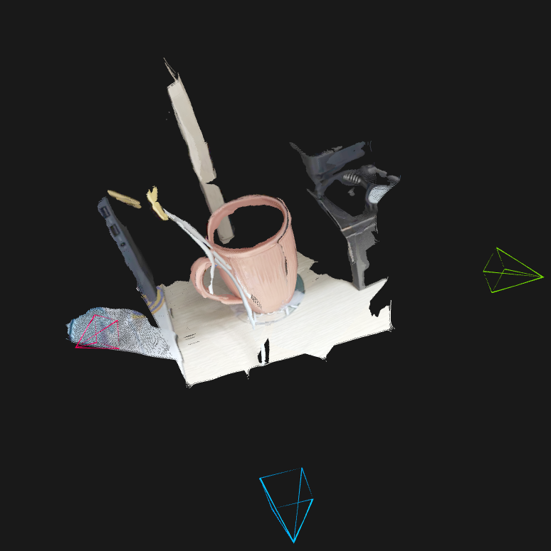

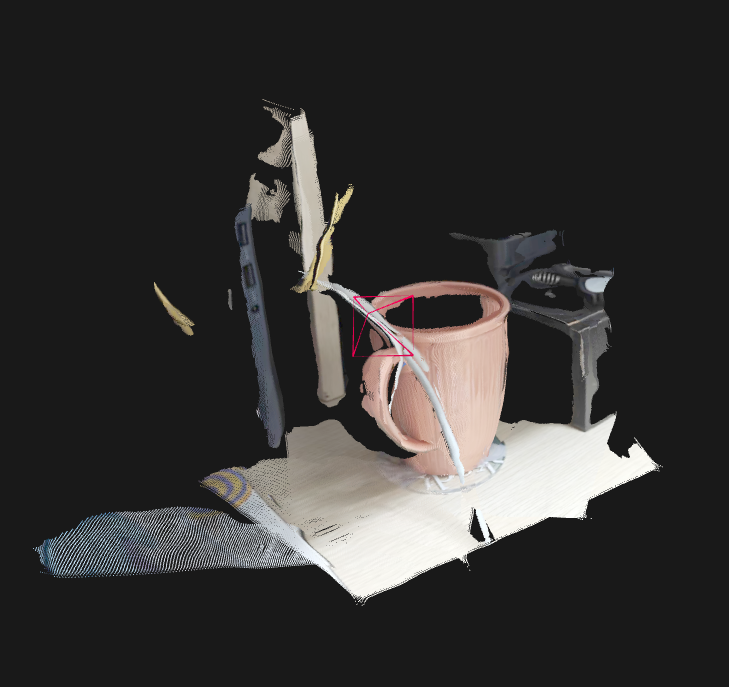

*Blender 里渲染出来的点云，两个角度。*

它完美保留了我水杯正面的形状，大致画出来了我缠在一起的充电线和网线的走向，
我露出一点的斯卡蒂杯垫和上面的字也完美还原了。

它还给了我置信度的热力图，还有去点以后原三视图的样式：

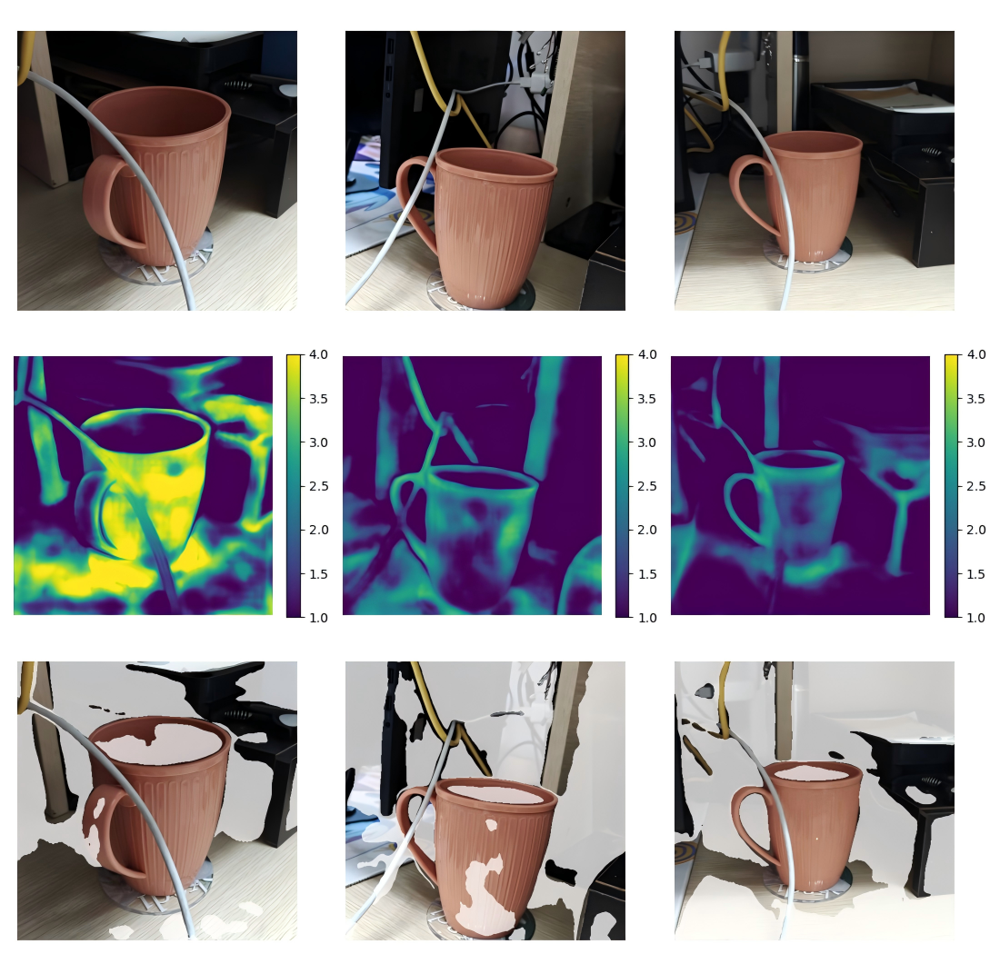

*第一行输入，第二行深度热力图（带 colorbar），第三行置信度过滤后的三视图。*

### 1.5 一个我绕进去的坑：为什么不去重

此时我还不是很懂 —— 为什么 AI 突然给我第三行这三个图？我想它是先做这三个图，然后再叠起来得 3D 图吗？
而且三个图里同一个物理位置的点要怎么认出来然后去掉？

所以其实 `world_points` 里就是存了三个图 3×518×518 所有点，
然后在全集里做去点操作以后，它输出了 3D 图，再反推出去点后的三视图。

**所以三个图里所有点都存着，世界坐标一样的点没被去掉。** 之前惯性思维感觉应该要去掉。

后来我查了才想通：每个 3D 点确实只对应一张 2D 图的一个像素。
点云里的点不是一堆没有来历的坐标 —— 第 `i` 个点的"身份证号"是写死在下标里的：

```
i = 第几张图 × 518 × 518  +  第几行 × 518  +  第几列
```

反过来算：

```python
s = i // (518 * 518)          # 第几张图
r = (i % (518 * 518)) // 518  # 第几行
c = i % 518                   # 第几列
```

实测验证（从 `pred_run_vggt.npz` 里抽点）：

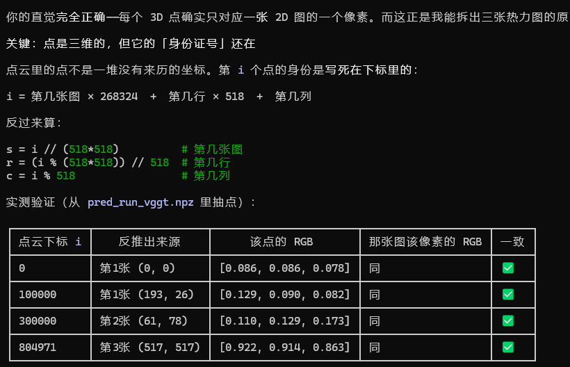

*拿 `i` 反推出来的 (图, 行, 列)，再去原图取该像素的 RGB，跟点云里那个点的 RGB 对比 —— 完全一致。*

同一个空间位置被三张图各重建一次，得到 3 个坐标略有差异的点，三个都进了点云。
**代码全程没有任何去重，而且是故意的。** 冗余实测（402,486 个点，场景尺度 2.01）：

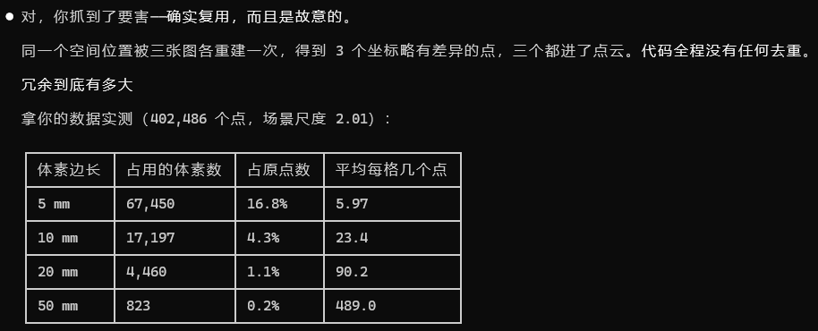

| 体素边长 | 占用的体素数 | 占原点数 | 平均每格几个点 |
|---|---|---|---|
| 5 mm | 67,450 | 16.8% | 5.97 |
| 10 mm | 17,197 | 4.3% | 23.4 |
| 20 mm | 4,460 | 1.1% | 90.2 |
| 50 mm | 823 | 0.2% | 489.0 |

**学到了。**

### 1.6 不去重的后果

事实证明不去点还是有点问题的。我多上传 3 个摄像头更近一点的照片以后，它直接做了两个杯子（其实是超级多个）：

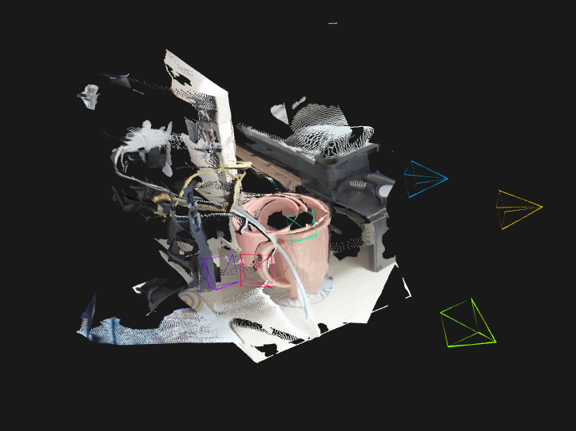

*4 个视角下，同一个杯子被重复重建，出现重影 —— 就是上面那个"三张图各建一次"在近距离大视角差下被放大了。*

不知道有没有这方面的研究。

### 1.7 回头看模型结构

看完输出再来看代码：

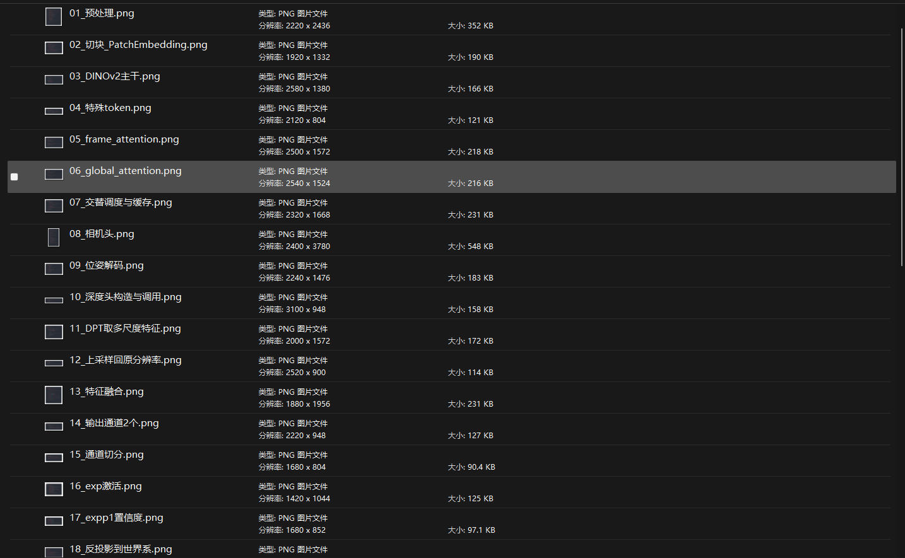

*自己整理的从预处理到反投影的 18 张结构图（01 预处理 / 02 切块 PatchEmbedding / 03 DINOv2 主干 / 04 特殊 token / 05 frame attention / 06 global attention / 07 交替调度与缓存 / 08 相机头 / 09 位姿解码 / 10 深度头构造与调用 / 11 DPT 取多尺度特征 / 12 上采样回原分辨率 / 13 特征融合 / 14 输出通道 2 个 / 15 通道切分 / 16 exp 激活 / 17 expp1 置信度 / 18 反投影到世界系）。*

预处理，切块，attention，上采样，输出，激活，求损失函数 —— 跟标准 ViT 一样的。
**但是它没做 softmax，而是引入了这个置信度**，学到了。

因为有 2D 和 3D 转换，这个模型还有解位姿，还有反投影，这些机器人课讲过，勉强看得懂在干嘛。

深度头和 DPT 我还是第一次见，学到了。

VGGT 的深度预测流程跟我了解的 ViT 的流程差不多，
具体代码内容由于我水平有限还看不懂，存着以后慢慢看。

---

## 二、Depth Anything 3

**DA3** 全名 **Depth Anything 3**，字节跳动做的。

这个名字我眼熟 —— DA 的前两代是"单张图猜深度"的，我用过。所以我以为第三代还是干这个。
结果一查，人家第三代直接跳到多视图几何了，跟 VGGT 抢同一个饭碗。

为啥跳？因为单张图猜深度，本质上猜不准（没有真实尺度），而多视图能真的把 3D 建出来。

我喂了完全一样的 8 张照片，用的最大那个版本，`DA3NESTED-GIANT-LARGE-1.1`：

| 指标 | 数值 |
|---|---|
| 参数量 | 1690 M |
| 前向耗时 | 71.2 秒 |
| 峰值显存 | 9.61 GB |
| `is_metric`（是否真实尺度） | True |
| 深度范围 | 0.58 ~ 5.64 |

**慢。比 VGGT 慢 4.5 倍。** 但点云一眼就看得出差别：

DA3 这边墙、天花板、整个房间能连成一片，VGGT 那边有很多破洞和飘着的碎片。
虽然深度图我看不出区别（下面会说），但拼成 3D 之后差距就出来了。

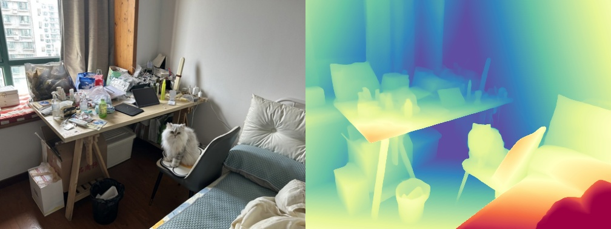

*DA3 自己导出的结果：左边是输入照片，右边是它算出来的深度（红=近，蓝=远）。*

这张图最直观。左边就是一个乱七八糟的房间照片，右边它就把远近关系画出来了：
桌子在最近处（红黄），后面的墙和角落最远（蓝）。
**这种图存下来直接能看，不用自己写代码画。**

---

## 三、把两个模型放在一起比

### 发现 1：深度图几乎一模一样

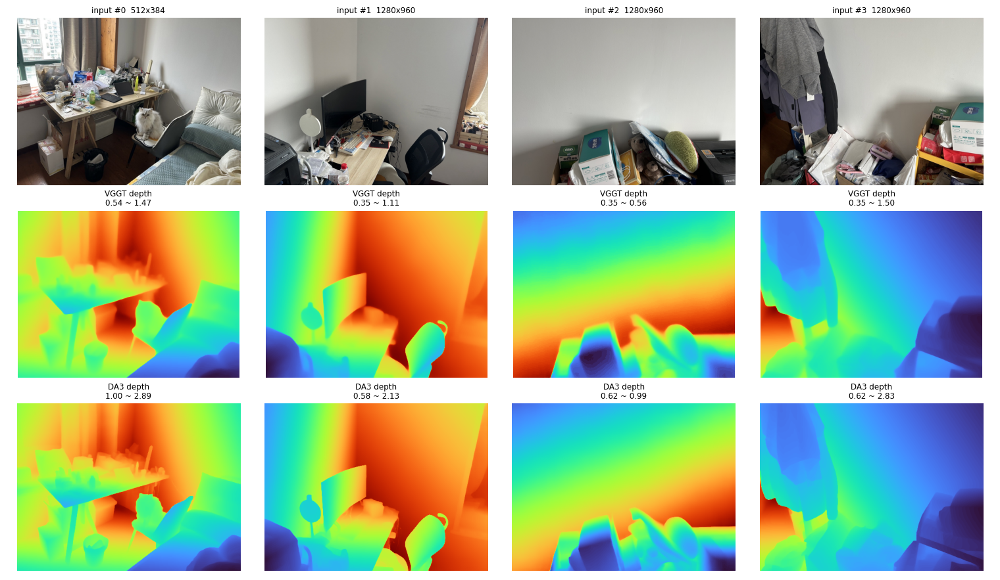

*第一行输入，第二行 VGGT 深度，第三行 DA3 深度。*

我是真看不出来。都是桌子近、远处墙远，形状完全对得上。

### 发现 2：但数值整整差了 1.9 倍

我不死心，把两边的深度数值拉出来逐帧对比：

| 第几张 | VGGT 最小~最大 | DA3 最小~最大 | 比值 |
|---|---|---|---|
| 0 | 0.54 ~ 1.47 | 1.00 ~ 2.89 | 1.96 |
| 1 | 0.35 ~ 1.11 | 0.58 ~ 2.13 | 1.91 |
| 2 | 0.35 ~ 0.56 | 0.62 ~ 0.99 | 1.77 |
| 3 | 0.35 ~ 1.50 | 0.62 ~ 2.84 | 1.88 |
| 4 | 0.43 ~ 2.69 | 0.91 ~ 5.64 | 2.10 |
| 5 | 0.60 ~ 1.27 | 1.11 ~ 3.05 | 2.39 |
| 6 | 0.54 ~ 1.27 | 1.08 ~ 2.44 | 1.92 |
| 7 | 0.54 ~ 1.57 | 1.02 ~ 3.05 | 1.95 |

每一帧，DA3 的数值差不多都是 VGGT 的 1.9 倍左右，**很稳定**。

这说明啥？说明两个模型看到的"形状"是一模一样的，只是尺子不一样。
就像你量身高，一个人说 1.8，一个人说 6，其实是同一个人，只是单位不同。
VGGT 吐出来的 0.54 不是"0.54 米"，它就是个数；DA3 吐出来的 1.00 才是"1.00 米"。

这就是我查资料时反复撞见的那个词：**尺度模糊（scale ambiguity）**。
VGGT 根本不知道一米是多长，因为它训练的时候看到的照片就没有真实尺寸信息。
DA3 声称自己知道 —— 我本地跑出来 `is_metric` 确实是 True。

> **顺便说个我觉得可疑的地方**：我给 DA3 喂单张玩具照片，它也说自己 `is_metric=True`，
> 还说最远有 4.1 米。一张照片推真实尺度，我觉得它是硬猜的，只是猜得挺像那么回事。
> 这种"模型很自信但其实在蒙"的地方，用的时候要留个心眼。

### 发现 3（顺手跑的）：小模型快得离谱

DA3 有一堆不同大小的版本。我把最小的那个也跑了一遍，同样 8 张图：

| 模型 | 参数量 | 耗时 | 峰值显存 |
|---|---|---|---|
| VGGT-1B | 1256 M | 15.7 秒 | 8.86 GB |
| DA3-GIANT-LARGE-1.1（最大） | 1690 M | 71.2 秒 | 9.61 GB |
| DA3-SMALL（最小） | 34 M | 1.39 秒 | 1.00 GB |

DA3-SMALL 比 VGGT 快了 **11 倍**，显存只用了 **九分之一**。
精度肯定差，但这个性价比太夸张了。它只有 34 M 参数，比我手机里某些 app 还小。

---

## 四、我踩到的坑

### 1. 显存就是命，8 GB 真的不够

我试着把照片加到 25 张（一个玩具的环绕视频抽帧），VGGT 直接变成 97 秒，峰值 9.23 GB。
时间涨了 6 倍多，**不是线性涨的**。

我查了下，原版 VGGT 大概 300 帧就 OOM（显存爆掉）了，想跑 200 帧得有 40 GB 的卡。
好消息是官方 2026 年 5 月修了个"中间张量占着显存不放"的 bug，
同样显存现在能跑 2-3 倍的帧数。

### 2. 光装模型就要一半显存

我本来以为是算得太慢，后来发现不是 —— 是**权重本身就巨大**。

- VGGT 光权重就占 **4.69 GB**
- DA3-GIANT 占 **6.36 GB**

我 8 GB 的卡，光把模型装进去就没剩多少了，所以一加图片就爆。
**这是我这台电脑真正的瓶颈，不是显卡算力不够。**

DA3-SMALL 的权重只有 **0.13 GB** —— 对比一下就知道差距多离谱。

### 3. 慢，做不了实时

DA3-GIANT 跑 8 张照片要 71 秒。这个速度没法用在什么实时的东西上。

### 4. 好看 ≠ 准

这个是我想了很久才意识到的。

两个模型的深度图我肉眼完全分不出来，但点云观感差很多。
所以如果你只看渲染出来的图判断哪个模型好，是**不靠谱的** ——
颜色、点密度、后处理都会影响观感，跟精度不是一回事。

---

## 五、许可证：这个最坑，必须单独说

我以前以为"开源"就是随便用。查完发现完全不是。这个东西分得特别细：

| 模型 | 许可证 | 能不能商用 |
|---|---|---|
| VGGT 原版权重 | CC BY-NC 4.0 | ❌ 不能 |
| VGGT 代码本身 | Meta 自定义（排除军事） | ✅ 能 |
| VGGT-1B-Commercial 权重 | 需填表申请 | ⚠️ 能，但要审批 |
| DA3-GIANT / LARGE | CC BY-NC 4.0 | ❌ 不能 |
| DA3-SMALL / BASE / LARGE-1.1 | Apache 2.0 | ✅ 能 |
| VGG-T³（NVIDIA） | OneWay Noncommercial | ❌ 不能 |
| π³ / Pi3 | BSD-2-Clause | ⚠️ 学术可以，商用要联系作者 |

两个点我觉得最值得记：

**一、** 我本地下载跑得最欢的那个 `DA3NESTED-GIANT-LARGE-1.1`，是**非商用**的。
拿它做个项目去卖钱，就是踩雷。

**二、** 那个又快又小、显存只要 1 GB 的 **DA3-SMALL，反而是 Apache 2.0，能商用**。
所以"大模型不能用、小模型能用"这种事是真的存在的 —— **选模型不能只看效果。**

---

## 六、现在最火 / 最强的是啥

结论很反直觉：**我跑的这俩，都不是最新的了。**

### VGGT-Omega（VGGT-Ω）

2026 年 5 月发的，CVPR 2026 Oral。从 0.2B 一路做到 10B 参数。
最主要解决的是 VGGT 处理不了动的物体这个问题，论文说相机位姿精度涨了 77%。

但是：权重要申请才能下（填表审批）。而且 2026 年 8 月官方自己发公告说，
发现 benchmark 可能被污染了，那个 1B 模型的成绩可能虚高，让大家先别信。
这个是官方自己承认的，我觉得挺实在，但也说明**数字不能全信**。

### D4RT

Google DeepMind 的，CVPR 2026 最佳论文，说比现有方法快 18-300 倍。
**但权重到现在没放出来，跑不了。**

### VGG-T³

NVIDIA 的，把 1000 张图从 11 分钟干到 54 秒。但有许可证限制，非商用。

### 还有一大堆改进版

VGGT-Long、FastVGGT、StreamVGGT、VGGT-SLAM…… 名字多到记不住。
它们基本都在解决同一个问题：**VGGT 跑不了长序列 / 太吃显存。**

### 一句大实话：这方向没有统一排行榜

每篇论文都说自己 SOTA（最强），但用的数据集不一样、口径不一样，还互相打架。
我看到有篇论文复现了某个号称第一的模型，结果在大规模场景下比它自己报的差得多。

所以我个人的经验是：**看论文里的数字，不如自己拿自己的图跑一遍。**

---

## 七、我的结论

1. **这东西是真能用。** 几张手机照片进去，一个完整的三维房间出来，不用标定相机、不用调参。
   放几年前是想都不敢想的。

2. **但 8 GB 显存玩这个就是受罪。** 想舒服点，16-24 GB 起步。
   瓶颈是显存不是算力，而且大头是权重本身。

3. **"开源"这两个字水分很大。** 以为开源 = 免费商用，是最大的误解。选模型之前先看许可证。

4. **VGGT 和 DA3 本质是同一个思路**（都是 transformer 一次前向把几何全吐出来）。
   选哪个主要看许可证、和你要不要真实尺度 —— 至少在普通场景下，我肉眼真看不出谁更准。

5. **最前沿的模型反而跑不了**（权重不公开或者要申请），能跑的又不是最新的。
   这个落差挺真实的，也是我这次最大的感受。

---

## 附：复现脚本

所有数字都是我在自己这台 **RTX 5060 Laptop (8GB)** 上实测的，不是抄论文的。
脚本都在本仓库 `code/` 下，是我自己写的（不是 clone 下来的上游代码）。

### `code/vggt/`

| 脚本 | 干什么 |
|---|---|
| `run_case.py` | 主脚本：跑 VGGT，记录参数量 / 耗时 / 峰值显存 / 深度范围，导出 `pred.npz` + `summary.json` + 深度网格图 + GLB |
| `run_vggt.py` | 最小可运行示例，就是上面那张"官网实践代码"截图，外加打印所有输出键的形状 |
| `run_vggt_glb.py` | 点云导出，支持 `point`（点图头）/ `depth`（深度反投影）两路对比 |
| `export_glb.py` | 从 `pred.npz` 单独导出带相机线框的彩色点云 GLB |
| `decode_pose.py` | 把 `pose_enc` 那 9 个数拆开读 —— 位置 / 四元数 / 两个 FOV |
| `compare_depth.py` | VGGT 与 DA3 深度图并排 + 逐帧数值范围对比（发现 2 那张表） |
| `compare_4way.py` | 四路点云对比（VGGT / DA3 × 单图 / 六图），直接从 GLB 抠点保证口径一致 |
| `render_pc.py` | 自己写投影 + 画家算法渲染点云，比 matplotlib 3D scatter 好看也快 |

### `code/da3/`

| 脚本 | 干什么 |
|---|---|
| `run_case.py` | 主脚本：跟 VGGT 版对齐口径，记录参数量 / 耗时 / 峰值显存 / `is_metric` / 深度范围 |
| `run_picture.py` | 最小可运行示例，只打印各输出的形状 |
| `da3.bat` | DA3 CLI 包装脚本，注入本地权重路径（默认的 HF repo id 在国内拉不到） |

### 环境

- VGGT：`pip install -r requirements.txt`，权重 `model.pt` 需自行下载（见上游 [facebookresearch/vggt](https://github.com/facebookresearch/vggt)）
- DA3：conda 环境 `da3`（Python 3.12 / torch 2.11+cu130），见上游 [ByteDance-Seed/Depth-Anything-3](https://github.com/ByteDance-Seed/Depth-Anything-3)
- 脚本里的绝对路径（`D:\VGGT\`、`D:\DA3\`）是我这台机器的，跑之前改成你自己的

### 两个环境上的坑（顺手记）

- **路径前面不加 `r` 会被吃掉。** `"D:\VGGT\a7ed..."` 里的 `\a` 是响铃转义符，
  路径会悄悄变样**还不报错**（`\V` 这种会有警告，`\a` 连警告都没有）。写 Windows 路径一律加 `r`。
- **`KMP_DUPLICATE_LIB_OK=TRUE`。** 不加偶尔会直接崩。

---

*本文是个人学习笔记，结论仅基于本机实测；模型许可证信息请以官方仓库为准（许可证会变）。*
